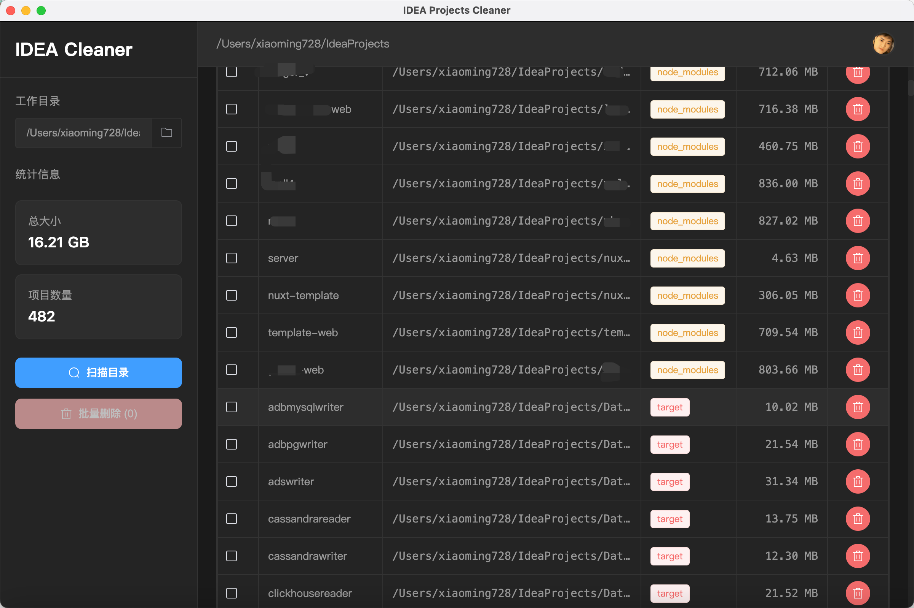

# IDEA Cleaner

<div align="right">

[English](README_EN.md) | 中文

</div>

一个用于清理 IDEA 项目中 node_modules 和 target 文件夹的桌面工具。

## 目录

- [IDEA Cleaner](#idea-cleaner)
  - [目录](#目录)
  - [功能特性](#功能特性)
  - [技术栈](#技术栈)
  - [开发](#开发)
  - [截图](#截图)
  - [下载](#下载)
    - [Windows](#windows)
    - [macOS](#macos)
    - [Linux](#linux)
  - [许可证](#许可证)
  - [作者](#作者)
  - [免责声明](#免责声明)

## 功能特性

- 🔍 扫描指定目录下的所有 node_modules 和 target 文件夹
- 📊 显示每个文件夹的大小和位置
- 🗑️ 支持单个删除和批量删除
- 💻 跨平台支持 (Windows, macOS, Linux)
- 🌙 暗色主题界面

## 技术栈

- Electron
- Vue 3
- Element Plus
- Vite

## 开发

```bash
# 安装依赖
npm install

# 启动开发服务器
npm run dev

# 构建应用
npm run build
```

## 截图



## 下载

访问 [Releases](../../releases) 页面下载最新版本。

### Windows
- 通用版（x64 & ARM64）：[IDEA Cleaner-Windows-1.0.0-Setup.exe](../../releases/download/v1.0.0/IDEA%20Cleaner-Windows-1.0.0-Setup.exe)
- 仅 x64：[IDEA Cleaner-Windows-x64-1.0.0-Setup.exe](../../releases/download/v1.0.0/IDEA%20Cleaner-Windows-x64-1.0.0-Setup.exe)
- 仅 ARM64：[IDEA Cleaner-Windows-arm64-1.0.0-Setup.exe](../../releases/download/v1.0.0/IDEA%20Cleaner-Windows-arm64-1.0.0-Setup.exe)

### macOS
- Intel Mac：[IDEA Cleaner-Mac-x64-1.0.0-Installer.dmg](../../releases/download/v1.0.0/IDEA%20Cleaner-Mac-x64-1.0.0-Installer.dmg)
- Apple 芯片：[IDEA Cleaner-Mac-arm64-1.0.0-Installer.dmg](../../releases/download/v1.0.0/IDEA%20Cleaner-Mac-arm64-1.0.0-Installer.dmg)

### Linux
- AppImage（通用版）：[IDEA Cleaner-Linux-x86_64-1.0.0.AppImage](../../releases/download/v1.0.0/IDEA%20Cleaner-Linux-x86_64-1.0.0.AppImage)
- Debian/Ubuntu：[IDEA Cleaner-Linux-amd64-1.0.0.deb](../../releases/download/v1.0.0/IDEA%20Cleaner-Linux-amd64-1.0.0.deb)
- RedHat/Fedora/CentOS：[IDEA Cleaner-Linux-x86_64-1.0.0.rpm](../../releases/download/v1.0.0/IDEA%20Cleaner-Linux-x86_64-1.0.0.rpm)

## 许可证

MIT

## 作者

[xiaoming728](https://xiaoming728.com)

## 免责声明

1. 本项目是一个开源工具，仅用于学习和技术交流目的。

2. 使用须知：
   - 在使用本工具删除文件夹之前，请确保已经备份重要数据
   - 建议在删除前仔细确认要删除的文件夹列表
   - 删除操作不可逆，请谨慎操作

3. 责任声明：
   - 本项目开发者不对因使用本工具而导致的任何数据丢失或损坏承担责任
   - 使用本工具所造成的任何直接或间接损失由使用者自行承担
   - 本工具不对文件删除操作提供恢复功能

4. 版权说明：
   - 本项目遵循 MIT 开源协议
   - 欢迎贡献代码，提交 issue 和 PR
   - 在遵守开源协议的前提下，可以自由使用、修改和分发本项目

5. 其他说明：
   - 本工具主要用于清理开发项目中的临时文件和构建产物
   - 如在使用过程中发现 bug，欢迎在 GitHub 提交 issue
   - 使用本工具即表示您同意本免责声明的所有条款

---
<div align="center">
<a href="#idea-cleaner">返回顶部</a>
</div>
